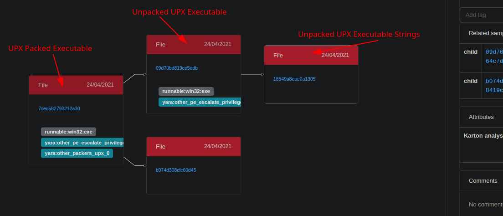

# Unpacker Karton Service

A modular Karton Framework service that unpacks common packers like UPX and others using the Qilling Framework.



**Consumes:**
```json
{
    "type": "sample",
    "stage": "recognized",
    "kind": "runnable",
    "platform": "win32"
},
{
    "type": "sample", 
    "stage": "recognized",
    "kind": "runnable",
    "platform": "win64" 
},
{ 
    "type": "sample",
    "stage": "recognized",
    "kind": "runnable",
    "platform": "linux"
}
```

```json
{
    "type": "sample",
    "kind": "raw",
    "payload": {
        "sample": <Resource>,
        "parent": <Resource>,
    }
}
```

## Usage

Make sure you have setup the core system: https://github.com/CERT-Polska/karton

```shell
$ git clone --recursive https://github.com/c3rb3ru5d3d53c/karton-unpacker.git
$ cd karton-unpacker/
$ virtualenv venv/
$ source venv/bin/activate
$ pip install .
$ karton-unpacker --config-file /home/karton/karton.ini --modules modules/
```
